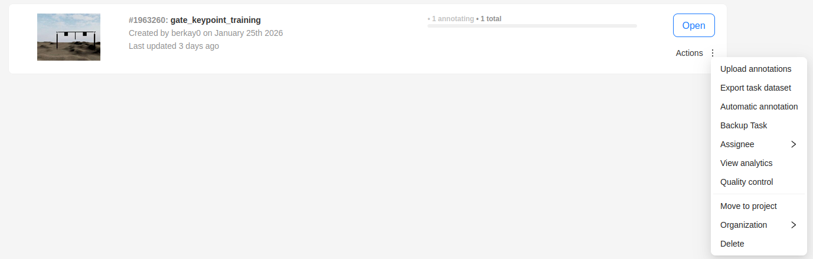
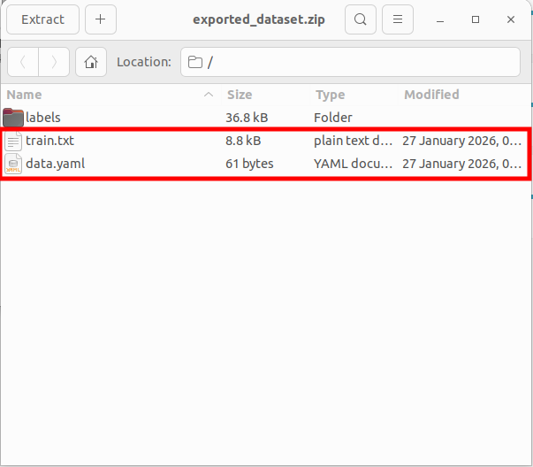
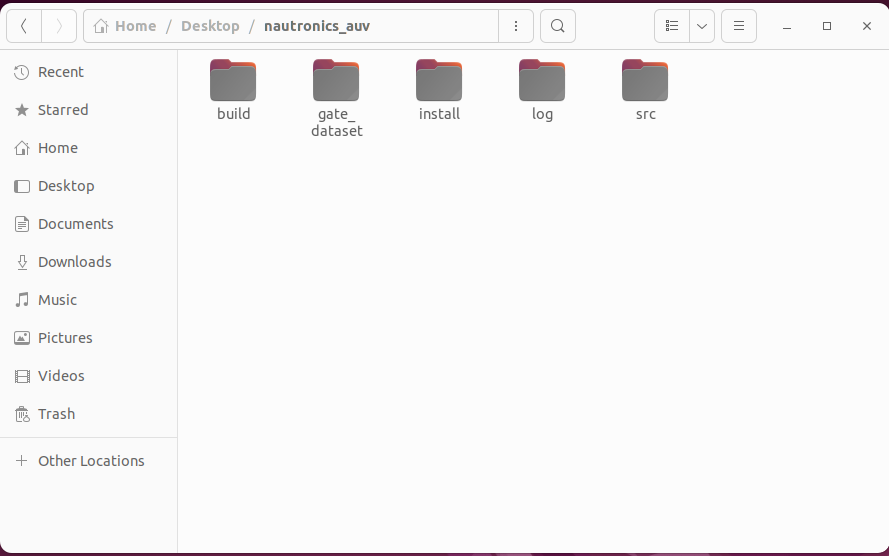
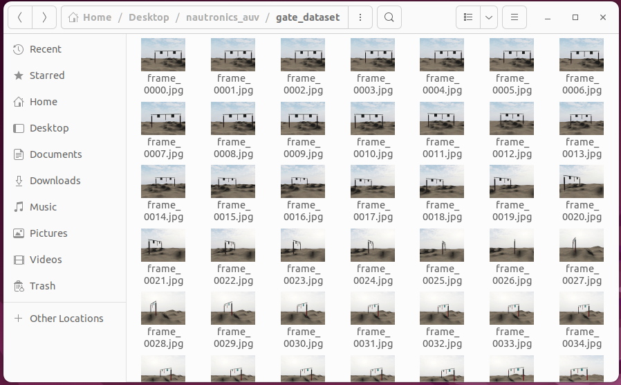
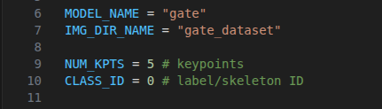
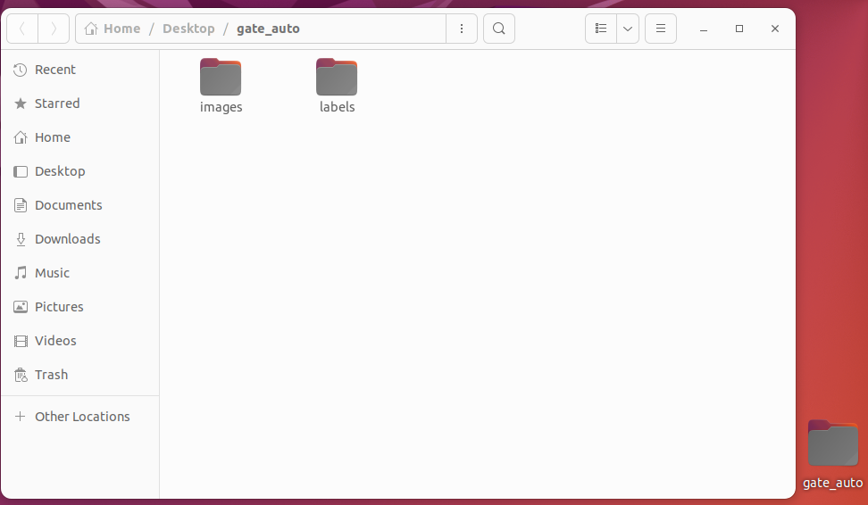
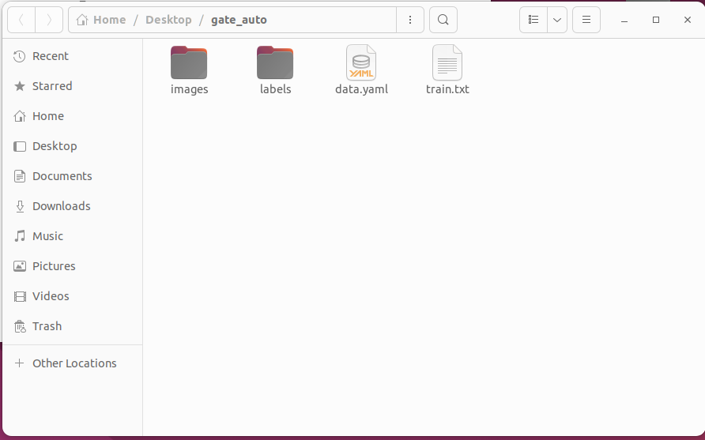
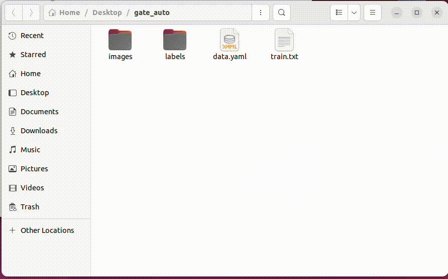
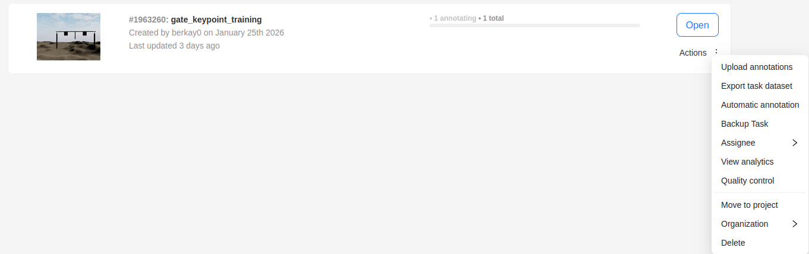

# Auto Annotator
This script uses a mini model created with few samples and using that model to annotate remaining huge dataset.

## Prerequisites
* A .pt model trained with few samples (~60 depending on the sample count)

## Steps
*All file and folder paths are given as and should be exactly same related to workspace root*
*ALl import and export formats are Ultralytics YOLO Pose 1.0*

### 1. Taking the data.yaml and train.txt
You should have a task in cvat that contains all dataset and a skeleton structure. *(e.g. a gate label with 5 keypoints)*
Go to cvat and export dataset of this task. Then download it and store data.yaml and train.txt files. We will use these files later.
<div align="left">
  
</div>
<div align="left">
  
</div>

### 2. Creating Annotations
Put your .pt model into "/src/nautronics_auv/auv_vision/models"

Put unlabeled images to workspace root *e.g. "/gate_dataset"*

!IMAGE NAME FORMAT SHOULD BE LIKE IN THE IMAGE BELOW!

<div align="left">
  
</div>

<div align="left">
  
</div>

Now, Open "/src/nautronics_auv/scripts/auto_annotator.py"
Change these parameters according to your .pt model and dataset folder's name
<div align="left">
  
</div>

* MODEL_NAME -> .pt model name in "/src/nautronics_auv/auv_vision/models"
* IMG_DIR_NAME -> folder name that contains images in workspace root *(e.g. gate_dataset)*
* NUM_KPTS -> number of keypoints in skeleton
* CLASS_ID = 0 # ID of skeleton label *(default is 0, don't change unless needed)*

Then, run the script via terminal:
```
python3 auto_annotator.py
```
This script creates a folder *(e.g. gate_auto)* on desktop. Then, copies the images and creates labels in correct folder structure. The folder created in desktop should look like this:
<div align="left">
  
</div>


### 3. Finalizing the structure
Copy data.yaml and train.txt files that you stored in step 1. Final view of this folder should be like this:
<div align="left">
  
</div>
Then, compress these files into a .zip
<div align="left">
  
</div>

### 4. Uploading the annotation
.zip file is ready. Upload that file to cvat task.
<div align="left">
  
</div>